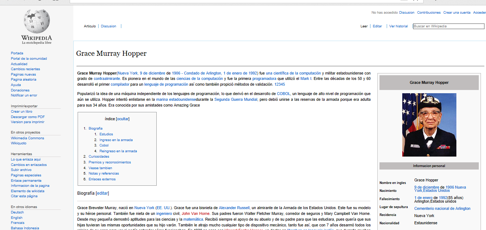

## GRACE H0OPER REACT

### `Objetivo`

Realizar una replica de la Biografia de Grace Hooper utilizando los componentes con React.

### `Componentes`

* El componente principal **App** contiene los siguientes componentes: **Aside**, **Header** y **Main**

* Asu vez el componente **Main** contiene a los componentes: **Biography**, **Information** y **Indice**

* Utilizando las expresiones **export** para indicar que puede ser utilizado en otros componentes y **import** para poder invocar al componente.

* De la misma manera se pueden importar las images de la aplicación.

### `Demo`

Realizado para [Laboratoria](http://laboratoria.la)
